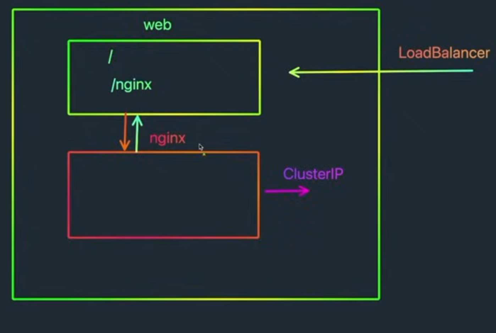

# Kubernetes Web to Nginx Deployment Guide

## Architecture Diagram



The above diagram illustrates the deployment architecture:
- **Web Container**: Contains the web application and Nginx configuration
- **LoadBalancer**: Handles external traffic distribution
- **ClusterIP**: Internal service communication
- **Nginx**: Internal Nginx service deployment

## Components Overview
1. **LoadBalancer Service** (External Access)
   - Routes external traffic to the web application
   - Exposes port 3333 to external users

2. **Web Application**
   - Contains Nginx configuration
   - Communicates with internal Nginx service
   - Runs on port 3000 internally

3. **Internal Nginx Service** (ClusterIP)
   - Internal service accessible only within the cluster
   - Provides Nginx functionality to the web application
   - Runs on port 80

## Configuration Files

### 1. Web Application (k8s-web-to-nginx.yaml)
```yaml
apiVersion: v1
kind: Service
metadata:
  name: k8s-web-to-nginx
spec:
  type: LoadBalancer
  selector:
    app: k8s-web-to-nginx
  ports:
    - port: 3333
      targetPort: 3000
---
apiVersion: apps/v1
kind: Deployment
metadata:
  name: k8s-web-to-nginx
spec:
  replicas: 3
  selector:
    matchLabels:
      app: k8s-web-to-nginx
  template:
    metadata:
      labels:
        app: k8s-web-to-nginx
    spec:
      containers:
        - name: k8s-web-to-nginx
          image: maldini12/k8s-web-to-nginx
          resources:
            limits:
              memory: "128Mi"
              cpu: "200m"
          ports:
            - containerPort: 3000
```

### 2. Nginx Server (nginx.yaml)
```yaml
apiVersion: v1
kind: Service
metadata:
  name: nginx
spec:
  selector:
    app: nginx
  ports:
    - port: 80
---
apiVersion: apps/v1
kind: Deployment
metadata:
  name: nginx
spec:
  replicas: 5
  selector:
    matchLabels:
      app: nginx
  template:
    metadata:
      labels:
        app: nginx
    spec:
      containers:
        - name: nginx
          image: nginx
          resources:
            limits:
              memory: "128Mi"
              cpu: "200m"
          ports:
            - containerPort: 80
```

## Deployment Steps

1. Deploy the Nginx server:
```bash
kubectl apply -f nginx.yaml
```

2. Deploy the web application:
```bash
kubectl apply -f k8s-web-to-nginx.yaml
```

## Access the Application

1. For Minikube users, expose the service:
```bash
minikube service k8s-web-to-nginx
```
This command will:
- Create a tunnel to the service
- Open your default browser with the service URL
- Display the service URL, port, and other details in the terminal
- The output will look something like:
```
|-----------|------------------|----------------|---------------------------|
| NAMESPACE |       NAME       |   TARGET PORT  |            URL           |
|-----------|------------------|----------------|---------------------------|
| default   | k8s-web-to-nginx |          3333  | http://192.163.88.9:3333 |
|-----------|------------------|----------------|---------------------------|
🎉  Opening service default/k8s-web-to-nginx in default browser...
```

## Verify the Deployment

1. Check if all pods are running:
```bash
# Check web application pods
kubectl get pods -l app=k8s-web-to-nginx

# Check nginx pods
kubectl get pods -l app=nginx
```

2. Verify services are created:
```bash
kubectl get services
```

3. Get the external IP for the web application:
```bash
kubectl get service k8s-web-to-nginx
```

## Service Communication

- The web application can reach Nginx using the service name `nginx` on port 80
- External users can access the web application through the LoadBalancer IP on port 3333
- For Minikube users, access is provided through the `minikube service` command


## Scaling

To scale the deployments:
```bash
# Scale web application
kubectl scale deployment k8s-web-to-nginx --replicas=<number>

# Scale nginx
kubectl scale deployment nginx --replicas=<number>
```

## Troubleshooting

1. Check pod logs:
```bash
# Web application logs
kubectl logs -l app=k8s-web-to-nginx

# Nginx logs
kubectl logs -l app=nginx
```

2. Describe services:
```bash
kubectl describe service k8s-web-to-nginx
kubectl describe service nginx
```

3. Check pod details:
```bash
kubectl describe pods -l app=k8s-web-to-nginx
kubectl describe pods -l app=nginx
```

4. If using Minikube and the service is not accessible:
```bash
# Check minikube status
minikube status

# Restart minikube if needed
minikube stop
minikube start

# Try exposing the service again
minikube service k8s-web-to-nginx
```

## Cleanup

To remove all resources:
```bash
kubectl delete -f k8s-web-to-nginx.yaml
kubectl delete -f nginx.yaml
```
